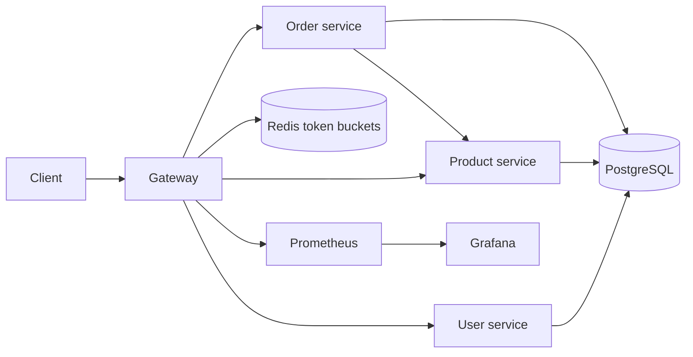

# FluxGuard

FluxGuard is a Java 21 / Spring Boot 3 gateway for three small services. Clients use the gateway on port `8080`; PostgreSQL, Redis, and the services stay on the private Compose network.



## Features

- JWT login and registration with BCrypt password hashes; registration always creates a `USER`.
- Gateway JWT verification, admin write rules, and matching service authorization.
- Redis token bucket limits shared across gateway replicas. The default bucket holds 100 requests and refills at 10 requests per second per token subject; anonymous authentication calls use the connection IP.
- Product CRUD and user-owned orders. The order service fetches current product prices before recording an order.
- Request IDs on gateway and service logs, metrics, three-second downstream timeouts, and circuit breaker fallbacks.
- Prometheus scraping and a provisioned Grafana overview dashboard.

## Run with Docker Compose

Install Docker with Compose. Copy `.env.example` to `.env`, then replace all placeholders. Generate a signing key with:

```sh
python -c "import base64,secrets; print(base64.b64encode(secrets.token_bytes(32)).decode())"
```

Put the output in `JWT_SECRET`. Set `DB_PASSWORD`, `ADMIN_EMAIL`, an `ADMIN_PASSWORD` of at least 12 characters, and `GRAFANA_PASSWORD`. The admin is created only when its email is absent from the database. Then run:

```sh
docker compose up --build -d
docker compose ps
```

Gateway: `http://localhost:8080` · Grafana: `http://localhost:3000` (login `admin` with `GRAFANA_PASSWORD`). Both published ports bind to localhost; Prometheus and service ports are internal to Compose. `docker compose down` stops the stack; `docker compose down -v` also removes stored data.

### Example API flow

```sh
curl -X POST http://localhost:8080/auth/register \
  -H 'Content-Type: application/json' \
  -d '{"name":"A User","email":"user@example.com","password":"long-password-123"}'

curl -X POST http://localhost:8080/auth/login \
  -H 'Content-Type: application/json' \
  -d '{"email":"user@example.com","password":"long-password-123"}'
```

Use the `accessToken` from login as `Authorization: Bearer <token>` for protected requests. Login with `ADMIN_EMAIL` and `ADMIN_PASSWORD` to create and edit products.

| Method | Gateway path | Access | Purpose |
| --- | --- | --- | --- |
| POST | `/auth/register` | Public | Create user |
| POST | `/auth/login` | Public | Issue one-hour JWT |
| GET | `/api/users/me` | User or admin | Own profile |
| GET | `/api/users/{id}` | Admin | User profile |
| GET | `/api/products`, `/api/products/{id}` | User or admin | Read products |
| POST, PUT, DELETE | `/api/products`, `/api/products/{id}` | Admin | Manage products |
| POST, GET | `/api/orders`, `/api/orders/{id}` | User or admin | Create/list/view own orders |
| DELETE | `/api/orders/{id}` | Owner or admin | Cancel a new order |
| PUT | `/api/orders/{id}/status` | Admin | Set `CREATED`, `FULFILLED`, or `CANCELLED` |

Create product body: `{"name":"Keyboard","description":"Mechanical","price":49.99,"stock":5}`. Create order body: `{"items":[{"productId":1,"quantity":2}]}`. Order prices are recorded from the product service, not accepted from the client. The order service checks available stock but does not reserve or decrement it; this is a traffic-management demo, not a transactional checkout.

## Develop and test

Use JDK 21 and Maven 3.9+:

```sh
mvn -B -ntp verify
```

Service integration tests use H2 and do not require Docker. The gateway integration test checks route registration, JWT/RBAC responses, request IDs, and fail-closed behavior when Redis is absent. For a full stack test, run Compose and exercise the endpoints above.

The CI workflow also starts Compose and runs `scripts/smoke.py` to check real routing, authorization, order pricing, Redis throttling, and a stopped product service. This requires Docker and cannot be covered by the H2 tests alone.

Run k6 after creating a user:

```sh
k6 run -e EMAIL=user@example.com -e PASSWORD=long-password-123 load/load.js
k6 run -e EMAIL=user@example.com -e PASSWORD=long-password-123 load/rate-limit.js
```

The default load scenario sends five requests per second for one minute. Tune `K6_RATE` and `K6_DURATION`; a single login token shares one Redis bucket across all virtual users. The rate-limit scenario sends 500 calls across ten virtual users and fails if no `429` is observed. Performance claims should be based on measured k6 output, not assumed from configuration.

## Operations and limits

- Gateway request IDs are regenerated on entry and passed downstream. Logs include method, path, status, and latency; no request bodies, tokens, or passwords are logged.
- Redis errors fail closed with `503`; unavailable services return `503`, and timeout fallbacks return `504` when the cause is a timeout. Gateway authentication returns `401`, role denial `403`, and token bucket exhaustion `429`.
- Metrics: gateway on its internal port `9090` at `/actuator/prometheus`; services at their own `/actuator/prometheus`. Grafana is preconfigured with Prometheus.
- The signing key is shared by gateway and services so each verifies JWTs independently. Keep `.env` private. Terminate HTTPS at a trusted reverse proxy in a real deployment.
- Hibernate `ddl-auto=update` creates demo tables. Use versioned migrations and separate database privileges before a production rollout.
- Order creation checks stock at request time but has no inventory reservation, payment transaction, or idempotency key. Those belong in a dedicated commerce workflow.

## Repository layout

`user-service/`, `product-service/`, `order-service/`, `gateway/` are Maven modules. `monitoring/` holds Prometheus and Grafana configuration; `load/` holds k6 scenarios. `compose.yaml` starts the complete local stack.
